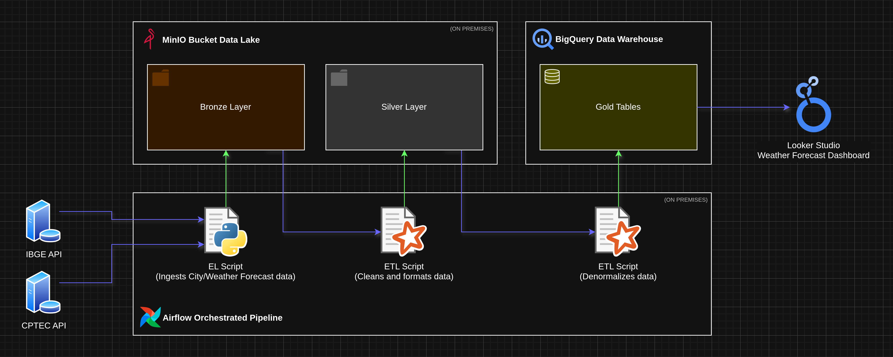

# BigQuery Weather Report Data Warehouse
O projeto se trata de uma pipeline ETL automatizada que constrói e alimenta um data lake(camadas Bronze e Silver) e um data warehouse(camada Gold) com dados vindos das APIs do IBGE(dados sobre cidades) e da CPTEC(dados de previsão do tempo).

O projeto mistura elementos on-premises(executados localmente) como o a pipeline automatizada com Airflow e o bucket MinIO(data lake) com elementos em nuvem como o BigQuery e a Dashboard.

Diagrama do projeto:


## Setup

### 1. Com Airflow e Docker:

#### 1.1 Baixar os arquivos deste repositório.
O primeiro passo para fazer o projeto funcionar é baixar os arquivos deste repositório para a sua máquina, isso pode ser feito navegando por meio de um terminal até o diretório onde você deseja colocar os arquivos e executar o comando `git clone https://github.com/VictorClvtt/weather-bigquery-warehouse.git` ou simplesmente baixando os arquivos pela interface do GitHub e extraindo o .zip onde desejar.

#### 1.2 Criar um projeto Astro.
Para isso será necessário já ter instalado na sua máquina os softwares `astro-cli`, `docker` e `docker-compose`.
Supondo que essas dependencias já estão instaladas basta criar um diretório para o seu projeto Airflow e executar o comando `astro-cli dev init` para iniciar um projeto Airflow no diretório desejado.

Depois disso você deve mover os arquivos do diretório [airflow/](airflow/) deste repositório para o diretório do novo projeto Airflow e sobrescrever arquivos/diretórios que tenham nomes iguais a de arquivos/diretórios que estão sendo movido para o diretório do projeto Airflow.

Também é importante que dentro do diretório [airflow/include/](airflow/include/) sendo copiado você crie um arquivo `.env` com a variável "GOOGLE_APPLICATION_CREDENTIALS" sendo o valor dela o caminho para um arquivo .json com suas credenciais da API do BigQuery que você deve criar através do console do GCP e armazenar idealmente no mesmo diretório do `.env`.

#### 1.3 Executar o projeto Astro.
Com todos os arquivos necessários em seus devidos lugares, basta executar o comando `astro-cli dev start` para que os containers Docker com os componentes do projeto(Airflow, MinIO, Spark Master e Spark Worker) sejam inicializados.

Após a inicialização terminar a pipeline ja vai estar funcionando, orquestrada pelo Airflow.

Para acessar a interface web do MinIO basta acessar https://127.0.0.1:9000 e inserir o nome de usuario padrão "admin" e a senha padrão "admin123" para logar. Para a interface web do Airflow basta acessar https://127.0.0.1:8080 e inserir o nome de usuario padrão "admin" e a senha padrão "admin" para logar.

### 2. Com Virtual Env local:

#### 2.1 Baixar os arquivos deste repositório.
O primeiro passo para fazer o projeto funcionar é baixar os arquivos deste repositório para a sua máquina, isso pode ser feito navegando por meio de um terminal até o diretório onde você deseja colocar os arquivos e executar o comando `git clone https://github.com/VictorClvtt/weather-bigquery-warehouse.git` ou simplesmente baixando os arquivos pela interface do GitHub e extraindo o .zip onde desejar.

#### 2.2 Preparar credenciais.
É importante que dentro do diretório raiz do projeto você crie um arquivo `.env` com a variável "GOOGLE_APPLICATION_CREDENTIALS" sendo o valor dela o caminho para um arquivo .json com suas credenciais da API do BigQuery que você deve criar através do console do GCP e armazenar idealmente no mesmo diretório do `.env`.

#### 2.3 Subir um container MinIO.
Já que este método de setup serve apenas para execuções manuais e testes, será necessário subir apena um container para o MinIO com o seguinte comando:
```bash
docker run -d \
  --name minio \
  -p 9000:9000 \
  -p 9001:9001 \
  -e MINIO_ROOT_USER=admin \
  -e MINIO_ROOT_PASSWORD=admin123 \
  quay.io/minio/minio server /data --console-address ":9001"
```
Após executar esse comando o MinIO estará rodando, é possível acessar a interface web do MinIO acessando https://127.0.0.1:9000 e inserindo o nome de usuario padrão "admin" e a senha padrão "admin123" para logar.

#### 2.3 Criar o Virtual Env.
Para criar o virtual env basta executar o comando `python -m venv .venv` para criar o ambiente, depois executar `source .venv/bin/activate` para ativar o ambiente e por fim executar `pip install -r requirements.txt` para baixar todas as dependencias necessárias para executar o projeto dessa forma.

Com o .venv criado já é possível executar o projeto manualmente, basta utilizar algum atalho da sua IDE para executar os scripts ou executa-los através do terminal utilizando o ambiente criado.

## Etapas

### 1. [bronze_ingest.py](src/etl/bronze_ingest.py): Script de ingestão de dados.
O primeiro script é responsável por fazer requisições às APIs do IBGE e da CPTEC, a API do IBGE retorna dados basicos sobre todas as cidades do estado de São Paulo, enquanto a API da CPTEC retorna dados de previsão do tempo de até seis dias após a data da requisição a partir dos nomes das cidades retornados pela API do IBGE. Com os dados em memória o script faz uma pequena transformação que torna os dados tabulares para que sejam gravados em formato CSV na camada Bronze do data lake.

O script faz isso utilizando principalmente as bibliotecas requests para fazer as requisições, a biblioteca Pandas para mudar a estrutura dos dados e a biblioteca Boto3 para gravar os dados em formato CSV no data lake.

### 2. [bronze_to_silver.py](src/etl/bronze_to_silver.py): Script de limpeza e formatação de dados.
O segundo script é responsável por padronizar, procurar por inconsistências e defeitos nos dados vindos da camada Bronze e gravar os dados limpos em formato Parquet na camada Silver do data lake.

O script faz isso utilizando principalmente o framework PySpark que possibilita a leitura dos dados para um tipo de dados(DataFrame) que oferece diversos métodos e atributos que permitem explorar e processar os dados com facilidade e rapidez.

### 3. [silver_to_gold.py](src/etl/silver_to_gold.py): Script de modelagem de dados.
O terceiro script é responsável por criar um modelo dimensional de banco de dados com os dados vindos da camada Silver e gravar os dados na camada Gold do data warehouse no BigQuery.

🥈 Schemas das tabelas da camada Silver:
```
📃 "silver_ibge_cities" table schema:
root
 |-- id: integer (nullable = true)
 |-- nome: string (nullable = true)
 |-- microrregiao_id: integer (nullable = true)
 |-- microrregiao_nome: string (nullable = true)
 |-- microrregiao_mesorregiao_id: integer (nullable = true)
 |-- microrregiao_mesorregiao_nome: string (nullable = true)
 |-- microrregiao_mesorregiao_UF_id: integer (nullable = true)
 |-- microrregiao_mesorregiao_UF_sigla: string (nullable = true)
 |-- microrregiao_mesorregiao_UF_nome: string (nullable = true)
 |-- microrregiao_mesorregiao_UF_regiao_id: integer (nullable = true)
 |-- microrregiao_mesorregiao_UF_regiao_sigla: string (nullable = true)
 |-- microrregiao_mesorregiao_UF_regiao_nome: string (nullable = true)
 |-- regiao_imediata_id: integer (nullable = true)
 |-- regiao_imediata_nome: string (nullable = true)
 |-- regiao_imediata_regiao_intermediaria_id: integer (nullable = true)
 |-- regiao_imediata_regiao_intermediaria_nome: string (nullable = true)
 |-- regiao_imediata_regiao_intermediaria_UF_id: integer (nullable = true)
 |-- regiao_imediata_regiao_intermediaria_UF_sigla: string (nullable = true)
 |-- regiao_imediata_regiao_intermediaria_UF_nome: string (nullable = true)
 |-- regiao_imediata_regiao_intermediaria_UF_regiao_id: integer (nullable = true)
 |-- regiao_imediata_regiao_intermediaria_UF_regiao_sigla: string (nullable = true)
 |-- regiao_imediata_regiao_intermediaria_UF_regiao_nome: string (nullable = true)
 |-- _source: string (nullable = true)
 |-- _ingestion_date: date (nullable = true)
 |-- _processing_date: date (nullable = true)

📃 "silver_cptec_cities" table schema:
root
 |-- nome: string (nullable = true)
 |-- id: integer (nullable = true)
 |-- estado: string (nullable = true)
 |-- _source: string (nullable = true)
 |-- _ingestion_date: date (nullable = true)
 |-- _processing_date: date (nullable = true)

📃 "silver_cptec_weather" table schema:
root
 |-- cidade: string (nullable = true)
 |-- estado: string (nullable = true)
 |-- atualizado_em: date (nullable = true)
 |-- data: date (nullable = true)
 |-- condicao: string (nullable = true)
 |-- condicao_desc: string (nullable = true)
 |-- min: integer (nullable = true)
 |-- max: integer (nullable = true)
 |-- _source: string (nullable = true)
 |-- _ingestion_date: date (nullable = true)
 |-- _processing_date: date (nullable = true)
```

🥇 Schemas das tabelas remodeladas da camada Gold:
```
📃 "dim_city" table schema:
root
 |-- id_ibge: integer (nullable = true)
 |-- id_cptec: integer (nullable = true)
 |-- nome: string (nullable = true)
 |-- nome_regiao: string (nullable = true)
 |-- uf_sigla: string (nullable = true)
 |-- uf_nome: string (nullable = true)
 |-- id_city: string (nullable = true)

📃 "dim_update_date" table schema:
root
 |-- data: date (nullable = true)
 |-- id_update_date: string (nullable = true)

📃 "dim_forecast_date" table schema:
root
 |-- data: date (nullable = true)
 |-- id_forecast_date: string (nullable = true)

📃 "dim_weather_condition" table schema:
root
 |-- condicao: string (nullable = true)
 |-- condicao_desc: string (nullable = true)
 |-- id_weather_condition: string (nullable = true)

📃 "fact_weather" table schema:
root
 |-- id_city: string (nullable = true)
 |-- id_update_date: string (nullable = true)
 |-- id_forecast_date: string (nullable = true)
 |-- id_weather_condition: string (nullable = true)
 |-- temperatura_min: integer (nullable = true)
 |-- temperatura_max: integer (nullable = true)
 |-- _source: string (nullable = true)
 |-- _ingestion_date: date (nullable = true)
 |-- _processing_date: date (nullable = true)
 |-- _modeling_date: string (nullable = false)
 |-- id_fact: string (nullable = true)
```

O script faz isso também utilizando principalmente o framework PySpark para ler os dados e criar um modelo dimensional Star Schema com os dados da camada Silver para permitir que esses dados sejam consumidos de forma mais fácil e eficiente para fins analíticos.

### 4. [Airflow](airflow/): Automação e agendamento da pipeline.
Nessa etapa do projeto foi criada uma DAG com Airflow que automatiza e define as dependências entre as Tasks da pipeline.

O setup de todo o ambiente, tanto pro Airflow quanto pro Spark e pro MinIO foi feito utilizando Docker, o que permite a reproducibilidade do ambiente e minimiza erros de execução da pipeline.

### 5. Dashboard: Painel interativo utilizando Looker Studio
Com o uso do serviço de criação de painéis interativos Looker Studio também do Google, foi possível com facilidade criar um Dashboard interativo com gráficos alimentados pelos dados climáticos de cada cidade.